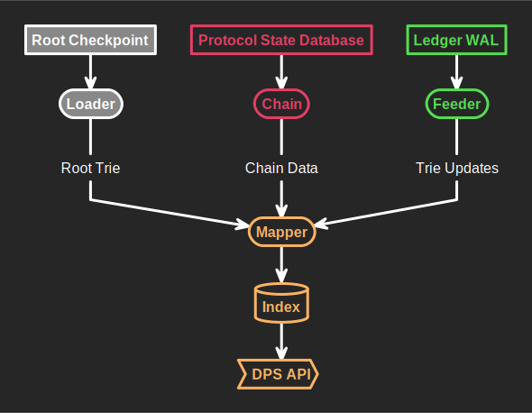
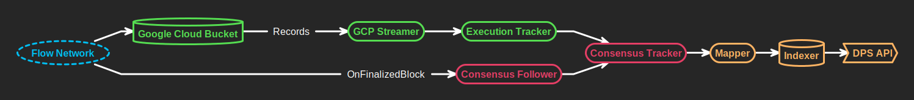
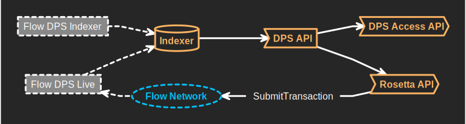

# Architecture

The following document gives a brief overview of different parts of the Flow DPS architecture.

## Flow DPS Indexer

The Flow DPS Indexer can only index past sporks, contrary to the [Flow DPS Live](#flow-dps-live) binary which indexes live sporks.
In order to build its index, it uses the spork's root checkpoint, and goes through the protocol state database and write-ahead logs from its nodes to index the state of the blockchain throughout its history.
It does not run the DPS API on its own, so the API must be started using the produced index, once the indexing operation is complete.

### Components

* [Loader](https://pkg.go.dev/github.com/optakt/flow-dps/service/loader) -- Loads checkpoints and retrieves their root trie.
* [Feeder](https://pkg.go.dev/github.com/optakt/flow-dps/service/feeder) -- Loads trie updates in chronological order.
* [Chain](https://pkg.go.dev/github.com/optakt/flow-dps/service/chain) -- Reads block data at any given height from the protocol state database.
* [Mapper](https://pkg.go.dev/github.com/optakt/flow-dps/service/mapper) -- Uses the aforementioned components to build its index.
* [Indexer](https://pkg.go.dev/github.com/optakt/flow-dps/service/index) -- Exposes a Reader and a Writer which give access to the index database.

## Flow DPS Live

The DPS Live binary fetches data from the Flow Network in two distinct ways:

* It acts as an [unstaked consensus follower](https://github.com/onflow/flow-go/blob/master/follower/consensus_follower.go#L20-L25), which allows it to have access to the protocol state and be notified when a new block is finalized.
* It downloads block records from a Google Cloud Storage bucket which is continuously updated by the Flow Network.

All of this information is then mapped into the DPS index, which is used by the DPS API.

### Components

* [GCPStreamer](https://pkg.go.dev/github.com/optakt/flow-dps/service/cloud) -- Downloads block records from a Google Cloud Storage bucket.
* [Consensus Tracker](https://pkg.go.dev/github.com/optakt/flow-dps/service/tracker#Consensus) -- Reads from the protocol database from an unstaked consensus follower and from the Execution Tracker.
* [Execution Tracker](https://pkg.go.dev/github.com/optakt/flow-dps/service/tracker#Execution) -- Reads block records from the GCPStreamer.
* [Mapper](https://pkg.go.dev/github.com/optakt/flow-dps/service/mapper) -- Uses the aforementioned components to build its index.
* [Indexer](https://pkg.go.dev/github.com/optakt/flow-dps/service/index) -- Exposes a Reader and a Writer which give access to the index database.
* [DPS API](https://pkg.go.dev/github.com/optakt/flow-dps/api/dps) -- Exposes the [DPS API](./dps-api.md), and reads from the DPS index.

## DPS APIs

The DPS API is a GRPC API that allows reading any data that was indexed by the Flow DPS, at any given height.
It is the dependency of both the [Flow Rosetta API](https://github.com/optakt/flow-rosetta) and the [DPS Access API](https://github.com/optakt/dps-access-api).

